# Tushika Architecture Studio - Website Architecture

## System Overview

This document outlines the architecture of the Tushika Architecture Studio portfolio website.

```mermaid
graph TD
    A[Client Browser] -->|HTTP/HTTPS| B[index.html]
    
    B --> C[Head Section]
    B --> D[Body Content]
    
    C --> C1[Meta Tags]
    C --> C2[Google Fonts<br/>Cormorant Garamond<br/>Inter]
    C --> C3[CSS Styling]
    
    D --> D1[Hero Section]
    D --> D2[Featured Projects Section]
    D --> D3[Studio References Section]
    D --> D4[Footer]
    
    D1 --> D1A[Hero Image Background]
    D1 --> D1B[Main Title]
    D1 --> D1C[Description Text]
    D1 --> D1D[CTA Button]
    
    D2 --> D2A[Project Grid<br/>3 Cards]
    D2A --> D2A1[Card 1: Luxury Residence]
    D2A --> D2A2[Card 2: Contemporary Bedroom]
    D2A --> D2A3[Card 3: Open Kitchen Studio]
    
    D3 --> D3A[Reference Grid<br/>4 Items]
    D3A --> D3A1[Responsive Grid Layouts]
    D3A --> D3A2[Premium Typography]
    D3A --> D3A3[Portfolio Presentation]
    D3A --> D3A4[Future Scalability]
    
    D3 --> D3B[Statistics Grid<br/>4 Stats]
    D3B --> D3B1[120+ Projects]
    D3B --> D3B2[15+ Design Awards]
    D3B --> D3B3[98% Client Satisfaction]
    D3B --> D3B4[10Y Experience]
    
    D4 --> D4A[Copyright Info]
    
    C3 --> S1[CSS Grid System]
    C3 --> S2[Flexbox Layout]
    C3 --> S2 --> S2A[Hero Container]
    C3 --> S2B[Card Containers]
    C3 --> S3[Color Scheme<br/>Dark Theme]
    C3 --> S4[Typography Scale<br/>Serif & Sans-serif]
    C3 --> S5[Animations<br/>Card Hover Effects]
    
    style A fill:#e1f5ff
    style B fill:#fff3e0
    style C fill:#f3e5f5
    style D fill:#e8f5e9
    style S1 fill:#fce4ec
    style S2 fill:#fce4ec
    style S3 fill:#fce4ec
    style S4 fill:#fce4ec
    style S5 fill:#fce4ec
```

## Component Architecture

### 1. **Header/Head Section**
- Meta tags for responsiveness and character encoding
- Google Fonts integration for premium typography
- Embedded CSS styling (no external stylesheets)

### 2. **Hero Section**
- Full viewport height (100vh)
- Background image with dark overlay gradient
- Centered content with hero title, description, and CTA button
- Responsive padding and max-width constraints

### 3. **Featured Projects Section**
- Responsive grid layout (auto-fit, min 320px)
- Three project cards with:
  - Project images (260px fixed height)
  - Project titles and descriptions
  - Hover animation (translateY -8px)

### 4. **Studio References Section**
- Reference grid (4 items) showcasing key features
- Statistics grid (4 stats) displaying studio achievements
- Dark background with rounded corners

### 5. **Footer**
- Copyright and studio name
- Centered text with muted color

## Design System

### Color Palette
- **Primary Dark**: `#0d0d0d` (body background)
- **Accent Gold**: `#d7b27b` (buttons, stat numbers)
- **Dark Neutral**: `#181818`, `#191919`, `#1d1d1d` (card backgrounds)
- **Light Text**: `#f4f4f4` (primary text)
- **Secondary Text**: `#c6c6c6`, `#d9d9d9` (secondary text)

### Typography
- **Headers**: Cormorant Garamond (serif) - 3.5rem to 6rem
- **Body**: Inter (sans-serif) - 1.15rem base size

### Layout Strategy
- **Responsive Grid**: `repeat(auto-fit, minmax(min-width, 1fr))`
- **Flexbox**: Hero section centering
- **Padding/Spacing**: 100px sections, 40px padding elements

### Animations
- Card hover: `translateY(-8px)` with 0.35s ease transition
- Smooth color transitions on interactive elements

## Technology Stack

- **Frontend**: HTML5 + CSS3
- **Fonts**: Google Fonts (external CDN)
- **Images**: Unsplash (external CDN)
- **Deployment**: Static HTML (no server required)

## Responsive Design

- Mobile-first approach with `auto-fit` grid layouts
- Minimum card width: 320px
- Flexible padding and font sizing
- Viewport meta tag for mobile optimization

## Future Enhancement Opportunities

1. Add JavaScript for interactive portfolio filtering
2. Implement smooth scroll animations
3. Add contact form functionality
4. Integrate SEO metadata and structured data
5. Add image lazy loading for performance
6. Implement dark/light theme toggle
7. Add project detail pages
